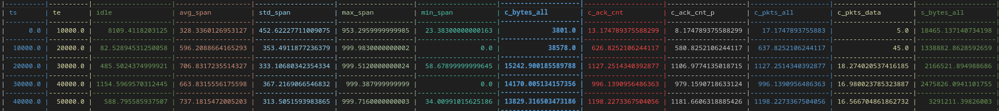

# streambot-post-processing-code
This repository contains three main Python scripts that help with post-processing streambot output documents.

## Components
- `asm` stands for Assembler, whose main objective is to feed tstat with `log_net_complete` derived from streambot, reconstructing TCP and UDP flows and bins in `log_tcp_complete`, `log_udp_complete`, `log_tcp_periodic`, and `log_udp_periodic` extracting useful information about video quality being requested from `log_har_complete`, and generating a JSON file containing flows, bins, and HTTP requests associated with an event (a playback).

- `pro` stands for Profiler, whose main objective is to inspect a collection of events and generate a frequency table that helps discover the most frequent server names involved during an event, alongside deriving those associated with live streaming by inspecting the HTTP requests.

- `sam` stands for Sampler, whose main objective is to apply a sliding window technique to live streaming flow bins to derive temporal and volumetric features for use in a classification algorithm, using the video qualities derived from HTTP requests as ground truth.


## Usage of `asm`
```sh
python asm/main.py \
    --input=<folder generated by streambot> \
    --provider="dazn" \
    --tests=<folder where to save all tests> \
    --events=<folder where to save all events>  
```

### Example
Let ```/home/user/2025-03-12_14-23-45``` be an output from streambot with 2 repetions inside. The folder would like:
```sh
$ ls -l /home/user/2025-03-12_14-23-45
total 48
-rw-r--r-- 1 user user  12345 Mar 12 14:23 log_har_complete-1.har
-rw-r--r-- 1 user user  23456 Mar 12 14:23 log_net_complete-1.pcap
-rw-r--r-- 1 user user   7890 Mar 12 14:23 log_bot_complete-1.csv
-rw-r--r-- 1 user user  14567 Mar 12 14:23 log_har_complete-2.har
-rw-r--r-- 1 user user  25678 Mar 12 14:23 log_net_complete-2.pcap
-rw-r--r-- 1 user user   8901 Mar 12 14:23 log_bot_complete-2.csv
```

For each tuple (`log_har_complete-x.har`, `log_net_complete-x.har`, `log_bot_complete-x.har`), a series of folders called `test-x` are generated in the folder passed with `--tests`, with `x` being an incremental number. These folders contain reconstructed flows, bins, and HTTP requests, organized according to the number of events/channels streambot has watched. If a repetition contains 3 channels, the code will generate three test folders, each containing a specific event, for a total of 6 test folders. At the end, for each test folder generated, the code will collapse flows, bins, and HTTP requests into a single JSON file called `event-x.json` to be saved in the folder passed as `--events`.

## Usage of `pro`
```sh
python pro/main.py --events=<folder with events> --provider="dazn"
```

## Usage of `sam`
```sh
python sam/main.py \
    --events=<folder with events> \
    --provider="dazn" \
    --samples=<folder generated where sampels are saved> \
    --winsize=<milliseconds>
```

### Example
Considering each event at time in the events folder, the code apply a sliding window technique to live streaming flow bins to derive temporal and volumetric features for use in a classification algorithm, using the video qualities derived from HTTP requests as ground truth.

<div align="center">
  
</div>
